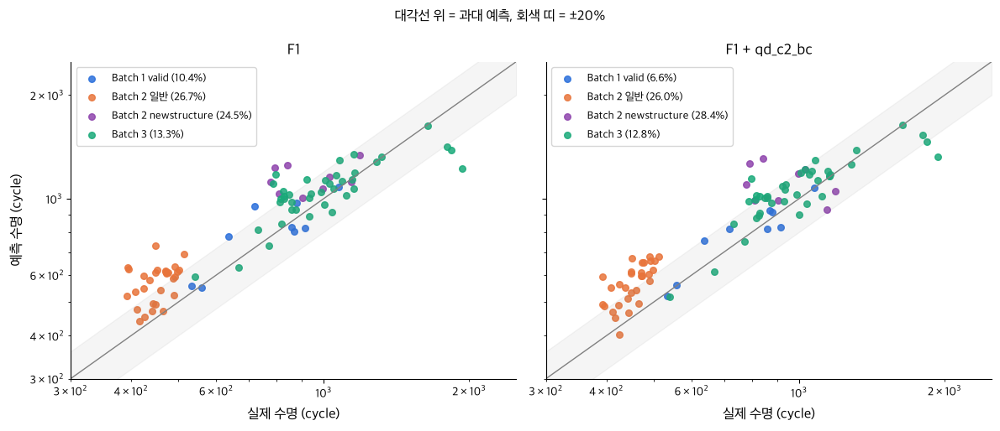

# ESS 배터리 수명 예측

초기 100 사이클 데이터로 셀의 수명(cycle life)을 예측해, ESS 배터리 교체를 수명 종료 전에 계획할 수 있는지 확인한다.

**결론 요약**
- 주 모델 : dq_var(cycle 100·10 방전 곡선 차이의 분산) 하나를 쓰는 선형회귀. Batch 1 CV 8.9%, Valid 10.4%
- Batch 3 13.3% 로 원논문 같은 구조 모델(11.4%)에 근접했고, Batch 2 는 26.2% 로 39셀 중 38셀을 길게 예측했다
- Batch 2 오차의 원인은 외삽(학습 범위 밖 값으로 예측)이 아니라 같은 dq_var 에서 수명 수준이 낮은 배치 차이로 보이며, Batch 1 만으로는 고칠 수 없다
- Batch 2 는 원논문의 테스트셋이 아니어서, 원논문과 같은 시험지(secondary test)로 비교할 수 있는 것은 Batch 3 뿐이다 (같은 구조 variance 모델 11.4%)

## 프로젝트 개요
- 데이터셋 : MIT-Stanford Battery Dataset (Severson et al., Nature Energy 2019)
- 학습 데이터 : Batch 1 (2017-05-12), 41셀
- 평가 데이터 : Batch 2 (2018-02-20), 39셀 / 추가 검증 Batch 3 (2018-04-12), 40셀
- 태스크 : **Regression** (Cycle Life 예측). 타깃 log10(cycle life), 지표 MAPE
- DAY 1 설계서 : [`docs/DS-MINI-Design-울산_4반-이채목+이진우.pdf`](docs/DS-MINI-Design-울산_4반-이채목+이진우.pdf). DAY 2 는 이 설계서에 고정한 피처·모델·검증 방식을 그대로 구현했다.

## 파일 구조
```
├── data/
│   └── README.md                  # 원본 .mat 받는 곳과 배치 방법
├── docs/
│   └── DS-MINI-Design-...pdf      # DAY 1 모델 전략 설계서
├── notebooks/
│   ├── 01_EDA.ipynb               # 5개 질문 EDA (Batch 1·2·3)
│   ├── 02_feature_engineering.ipynb  # 피처 세트, 선택 규칙, Batch 1 사전 CV
│   └── 03_modeling.ipynb          # 학습·평가, 성능표, 오류 분석
├── src/
│   ├── preprocess.py              # .mat → 셀 단위 pickle
│   ├── features.py                # 셀 정리(제외·수명 보정), 초기 100 사이클 피처
│   ├── split.py                   # Batch 1 정책 단위 분할
│   ├── train.py                   # 학습·평가 (성능표·예측 저장)
│   └── procedure.py               # 시험 절차(휴지 시간) 측정
├── results/
│   ├── model_performance.csv      # 주 모델 성능표 (과제 포맷)
│   ├── model_comparison.csv       # 전체 모델 비교
│   ├── predictions.csv            # 셀별 예측 (CV 폴드 밖 / valid / Batch 2 / Batch 3)
│   ├── cv_folds.csv               # 폴드별 MAPE
│   ├── cell_features.csv          # 셀별 피처 (01_EDA)
│   ├── prelim_cv.csv              # DAY 1 사전 CV (02_feature_engineering)
│   ├── procedure_timing.csv       # cycle 10 사이클 길이·휴지 시간 (procedure.py)
│   └── figures/
├── requirements.txt
└── README.md
```

## 환경 설정
```bash
git clone https://github.com/97-99-02/ess-battery-project
cd ess-battery-project
pip install -r requirements.txt      # Python 3.11
# data/README.md 대로 .mat 3개를 data/raw/ 에 둔다
python src/preprocess.py             # data/processed/b1·b2·b3.pkl
python src/train.py                  # results/*.csv
python src/procedure.py              # 선택 : results/procedure_timing.csv (원본 .mat 시계열 필요, 결과는 커밋돼 있음)
```
노트북은 01 → 02 → 03 순서로 실행한다 (03 은 `train.py` 를 다시 돌린다. 시드 42 고정이라 같은 숫자가 나온다).

## 데이터 정리
논문 공식 코드(Load Data.ipynb)의 기준을 따른다 (설계서 부록 A2).

| 배치 | 원본 | 제외 | 사용 | 비고 |
|---|---|---|---|---|
| Batch 1 | 46 | 80% 미도달 5셀 | 41 | 다음 배치에서 측정이 이어진 c0~c4 수명 보정 (+208~+1060). 보정하지 않으면 가장 긴 셀이 2237 이 아니라 1177 로 들어간다 |
| Batch 2 | 47 | 수명값 없음 8셀 | 39 | 일반 30셀 + newstructure 9셀 |
| Batch 3 | 46 | noisy 6셀 | 40 | 전부 newstructure. 원논문 secondary test 와 같은 배치이고, 공식 코드 기준 셀 수(40)도 같다 |

newstructure : 충전 정책 이름에 `newstructure` 가 붙은 셀. 사이클 사이 휴지 시간을 거의 없앤 시험 절차로 측정됐다 (Batch 2 의 9셀, Batch 3 전부).

## EDA
- **Cycle Life 분포**
  - 중앙값 842 / 472 / 964.5 (Batch 1 / 2 / 3). 장수명(>1,000) 24 / 8 / 48%, 단수명(<500) 0 / 72 / 0%. log10 변환으로 오른쪽 꼬리가 줄었다.
  - 이상치 셀 : 박스플롯 기준 이상치는 모두 긴 쪽이다. 배치별로 가장 짧은 셀은 가혹한 충전 정책에 몰린다 (Batch 1 534·559 는 5.4C 일정 전류, Batch 2 392·393 은 6C(60%)-3C·3.6C(9%)-5C, Batch 3 541 은 3.7C(31%)-5.9C).
  - 핵심 발견 : 학습 배치에 550 미만 셀이 41개 중 1개뿐이라 분류를 학습할 수 없다 → 회귀. 과제 설명과 달리 Batch 2 는 Batch 1 과 비슷하지 않다. 일반 셀 30개 전부가 Batch 1 최솟값(534)보다 짧다.
- **열화 곡선 분석**
  - 처음 100 사이클은 거의 평탄하다 (cycle 100 / cycle 2 용량 중앙값 +0.22%). 열화는 가속되어 수명의 마지막 20% 구간 속도가 처음 20% 의 약 37배다. knee 는 수명의 55~82% 지점이고 가장 이른 것도 cycle 244 다.
  - 장수명 vs 단수명 : 가로축을 cycle / 수명으로 바꾸면 세 배치 곡선이 비슷한 모양으로 모인다. 열화 속도 차이는 대부분 수명 길이 차이이고, 용량 손실 대부분이 수명의 마지막 20% 에서 일어난다.
  - 핵심 발견 : 예측 시점(cycle 100)에는 용량 값의 차이도 knee 도 없다. 신호는 곡선 모양에서 찾아야 한다.
- **ΔQ(V) 곡선 분석**
  - ΔQ<sub>100-10</sub>(V) = Q<sub>100</sub>(V) − Q<sub>10</sub>(V). 골은 3.1~2.9V 부근이고, 수명 하위 셀의 골이 더 깊다 (−0.035~−0.065Ah vs 상위 −0.025Ah 이내). 분산(dq_var)과 log 수명의 상관 −0.945 / −0.918 / −0.805.
  - 핵심 발견 : 같은 셀 두 사이클의 차이라, 과제가 지적한 배치별 Qdlin 시작점(곡선 위치) 차이가 상쇄된다.
- **충전 속도(C-rate)와 수명의 관계**
  - Batch 1 에서 평균 충전 속도와 log 수명 r = −0.78. 가장 느린 3.6C 셀 1852~2237, 가장 빠른 5.4C 셀 534·559.
  - 충전 전류 패턴과 열화 속도 : Batch 1 은 평균 충전 속도가 빠를수록 cycle 2~100 용량 감소가 빨랐고 (r = −0.62), 평균 속도가 같은 Batch 3 는 높은 SOC 구간 전류 C2 가 클수록 빨랐다 (r = −0.73).
  - 핵심 발견 : Batch 2·3 은 모든 정책의 평균 충전 속도가 4.8C 로 같아 정책 피처로 학습한 관계를 옮길 수 없다 → 충전 조건의 영향은 ΔQ 로 받는다.
- **추가 확인한 내용**
  - dq_var 는 정책 간 차이를 담고(평균 충전 속도의 영향을 뺀 편상관 −0.857) 같은 정책 안의 셀 차이는 못 잡는다(−0.02). 초기 용량은 정책 안 차이를 잡지만(+0.70) 절대값이라 배치 오프셋(배치 전체가 한쪽으로 치우친 값)을 그대로 받는다.
  - 다중공선성 : dq_var·dq_min·dq_mean, 충전 시간·평균 충전 속도가 각각 r 0.99 로 묶이고 Batch 1 VIF 가 최대 384 다. 주 모델에는 하나만 두고, 여러 피처를 쓰는 세트는 규제 모델(ElasticNet·Ridge)로만 다룬다.
  - Batch 2 일반 셀은 시험 절차도 다르다. cycle 10 의 휴지 합계가 Batch 1 1.0분, Batch 2 일반 9.9분, newstructure·Batch 3 0.3분 (`src/procedure.py`, 라벨 미사용).

## Modeling
### 피처 엔지니어링 전략
선택 규칙은 DAY 1 에 고정했다 (설계서 S2·S3). 결정에는 Batch 1 과 라벨 없는 입력 분포만 썼다.
1. **입력 규칙 ①** : Batch 2 입력이 Batch 1 평균 ± 2σ(표준편차 2배) 밖, 즉 학습 분포 밖인 셀이 39개 중 4개 이하인 피처만 주 모델에 쓴다. dq_var 는 1셀, 용량 계열은 18~24셀이 벗어난다.
2. **1-SE 규칙 ②** : ① 통과 세트 중 CV 최저 모델과 1 표준오차 안이면 같은 성능으로 보고, 그중 가장 단순한 모델을 고른다.
3. **예외** : 배치 평균을 빼는 등 배치 단위로 변환한 피처는 ① 의 판정 대상이 아니며 확장 후보로만 둔다.

| 세트 | 피처 | 역할 |
|---|---|---|
| **F1** | dq_var | **주 모델** |
| 확장 1순위 | dq_var, qd_c2_bc (같은 배치 평균을 뺀 cycle 2 용량) | 함께 보고 |
| 2피처 | dq_var, qd_c2 (원값) | 비교 (규칙 ① 탈락) |
| F2 / F3 / F4 | ΔQ 통계량 5개 / + 2V·방전 용량 곡선 7개 / + 충전 시간·온도·내부저항 (논문 Supplementary Table 1 구성, 첨도·2V 는 논문 정의) | 선택 |

### 모델 선택 및 근거
- 후보 모델 : 선형회귀 (F1, 확장 1순위, 2피처), ElasticNet·Ridge (F2·F3·F4), RandomForest·XGBoost (F1, 비선형 확인), 기준선 2개 (학습 평균, 용량 곡선 피처만)
- 최종 모델 : **F1 선형회귀** `log10(life) = 1.5524 − 0.3537 · dq_var` (Batch 1 41셀)
- 선택 이유 : 규칙 ① 을 통과한 세트에서 Batch 1 CV 가 가장 낮고(8.93%) 가장 단순하다. Batch 2 입력이 Batch 1 평균 ± 2σ 밖인 셀이 39개 중 1개뿐이다 (Batch 1 최솟값~최댓값 범위 기준으로는 28% 가 밖이지만 거리는 짧다). 원논문 variance 모델(재구성 12.3%, secondary 11.4%)과 같은 구조라 직접 비교할 수 있다.
- 검증 : Batch 1 을 충전 정책 단위로 train 32셀·17정책 / valid 9셀·5정책으로 나눴다 (같은 정책 셀이 양쪽에 들어가지 않게). Train 은 train 32셀 정책 단위 GroupKFold(5), Valid 는 train 32셀 모델로 평가했다. Test 는 같은 절차를 Batch 1 41셀 전체로 다시 학습한 최종 모델로 Batch 2·3 를 한 번 평가했다. 32셀 모델과 41셀 모델의 Batch 2 예측 차이는 테스트 전에 라벨 없이 재 두었다 (0.99배).

## 성능 결과
주 모델 F1 (`results/model_performance.csv`). Gap(Train-Valid)·(Valid-Test)·(Target-Test) 는 '뒤 − 앞' 으로 계산해 (+) 가 나빠짐이다. Gap(Batch2-Batch3) 는 이름대로 Batch 2 − Batch 3 다 ((+) : Batch 2 가 나쁨).

| 구분 | | MAPE (%) | 비고 |
|---|---|---|---|
| Train (Batch 1 CV) | | 8.93 | 폴드 표준편차 3.1 |
| Valid (Batch 1 Hold-out) | | 10.41 | 9셀, 부트스트랩 95% 구간 4.7~17.5 |
| Test (Batch 2) | | 26.17 | 최종 모델, 한 번 평가 |
| | Gap (Train-Valid) | +1.48 | (+) : 과적합 의심 |
| | Gap (Valid-Test) | +15.76 | (+) : 배치간 일반화 저하 의심 |
| | Gap (Target-Test) | +17.07 | Target : 원논문 9.1%. 같은 구조인 variance 모델을 같은 방식으로 재구성한 12.3% 대비 +13.87 |
| Test (Batch 3) | | 13.25 | 추가 검증 |
| | Gap (Batch2-Batch3) | +12.92 | Test 성능 간 비교. Batch 2 가 12.92%p 나쁨 |
| | Gap (Target-Test) | +4.15 | Batch 3 기준. 같은 배치인 원논문 variance 모델 secondary test 11.4% 대비 +1.85 |

Target 9.1% 는 원논문 Table 1 의 full 모델(충전 시간·온도·내부저항 포함)에서 이례 셀 1개를 뺀 primary 7.5% 와 secondary 10.7% 를 셀 수로 가중한 값과 일치한다. 같은 방식으로 dq_var 하나인 variance 모델은 12.3% 다.

단, 9.1% 는 원논문의 test 셀에서 낸 값이다. primary test 43셀은 2017-05-12·2017-06-30 두 배치를 합쳐 train 과 번갈아 나눈 셀이고 (우리 Batch 1 셀 일부도 원논문에서는 primary test 였다), secondary test 40셀은 2018-04-12 배치다. 과제의 Batch 2(2018-02-20)는 원 출처([data.matr.io](https://data.matr.io/1/projects/5c48dd2bc625d700019f3204))의 논문 배치 목록(2017-05-12·2017-06-30·2018-04-12)에 없고 'Low rate data used to generate figure 4' 로 따로 분류된 파일이다. 그래서 Batch 2 의 Gap(Target-Test)은 같은 테스트셋끼리의 비교가 아니다. 원논문과 같은 배치로 비교할 수 있는 것은 Batch 3 (secondary test) 뿐이다.

**함께 보고하는 모델** (`results/model_comparison.csv`)

| 모델 | Train CV | Valid | Batch 2 | Batch 3 |
|---|---|---|---|---|
| **F1 (주 모델)** | 8.93 | 10.41 | 26.17 | 13.25 |
| F1 + qd_c2_bc (확장 1순위) | 6.63 | 6.63 | 26.56 | 12.79 |
| 2피처 (F1 + qd_c2 원값) | 6.63 | 6.63 | 45.80 | 10.53 |
| 기준선 : 학습 평균 | 28.29 | 24.22 | 73.24 | 18.79 |
| 기준선 : 용량 곡선 7개 ElasticNet | 23.61 | 22.37 | 185.40 | 36.06 |
| F3 ElasticNet (선택) | 8.84 | 10.75 | 33.45 | 9.72 |

F3 ElasticNet 은 원논문 discharge 모델과 같은 구성이라, Target 과 같은 방식으로 재구성한 discharge 9.4% 와 짝지어 본다 (`model_comparison.csv` 의 `paper_ref`).

확장 1순위와 2피처의 Train·Valid 가 같은 것은 오류가 아니다. Batch 1 안에서 qd_c2_bc 는 qd_c2 에서 같은 값(Batch 1 평균)을 뺀 것이라 두 모델의 예측이 같고, 차이는 평균이 다른 Batch 2·3 에 적용할 때만 생긴다.



대각선 위 = 실제보다 길게 예측(과대 예측), 회색 띠 = ±20%. Batch 2 일반 셀(주황)이 대각선 위로 몰려 있다.

**Gap 해석**
- Train-Valid(+1.48) 는 Valid 9셀의 구간(4.7~17.5) 안이라 과적합 신호는 약하다.
- Valid-Test(+15.76) 는 Batch 2 에서 체계적인 과대 예측 때문이다. 일반 셀 30개 전부, newstructure 9개 중 8개를 길게 예측했다 (실제 / 예측 중앙값 0.78, 0.89).
- 외삽이 주원인은 아니다. dq_var 가 Batch 1 범위 밖인 Batch 2 일반 셀 11개의 오차(13.3%)가 범위 안 19개(34.4%)보다 작다. 같은 dq_var 에서 수명 수준이 낮게 평행 이동한 것이 원인이고, 이 차이는 Batch 1 에 없는 요인이라 Batch 1 만으로는 고칠 수 없다 (설계서가 DAY 1 에 '가장 큰 위험'으로 적은 내용).
- Batch2-Batch3(+12.92) : 같은 F1 이 Batch 3 에서는 원논문 variance 모델과 1.85%p 차이로 논문 수준이다. 그래서 Gap 이 큰 원인은 피처가 특정 배치에 과적합된 것이 아니라 Batch 2 의 수준 이동으로 본다. Batch 2 일반 셀은 시험 절차도 다르지만(휴지 9.9분, Batch 1 1.0분, Batch 3 0.3분), 절차가 Batch 3 와 같은 Batch 2 newstructure 도 과대 예측(실제 / 예측 0.89)이라 절차만으로는 설명되지 않는다. Batch 2 셀 로트의 차이일 가능성도 남는다.
- 초기 용량 원값을 더한 2피처는 Batch 1 CV 가 가장 좋았지만 Batch 2 에서 45.8% 로 나빠졌다. 설계서가 라벨 없이 예상한 배치 오프셋(예측 +16%)이 실제로 나타났다.
- 반대로 Batch 3 에서는 2피처(10.53%)와 F3 ElasticNet(9.72%)이 F1(13.25%)보다 낮다. Batch 3 는 초기 용량이 학습 배치보다 낮아 2피처 예측이 약 10% 내려가고(설계서 부록 A11, 라벨 미사용), 이것이 F1 의 과대 예측(실제 / 예측 0.94)을 우연히 상쇄했다. 같은 효과가 Batch 2 에서는 반대 방향(+16%)으로 작용해 45.8% 가 됐다. 용량 계열 피처를 포함한 F3 도 같은 양상이다 (Batch 2 33.45%). 배치마다 방향이 바뀌므로 주 모델로 쓸 근거가 아니다.
- 설계서 약속대로 적는다 : 첨도·2V 를 논문 정의로 바꾸자 F3 ElasticNet CV 가 8.97 → 8.84% 로 F1(8.93%)보다 근소하게 낮아졌다. 1-SE 안이고 규칙 ① 탈락 세트라 주 모델은 바뀌지 않는다.

## 오류 분석
- **가장 크게 틀린 셀의 공통점** : F1 의 Batch 2·3 오차 상위 10셀은 모두 과대 예측이다 (Batch 2 일반 5, newstructure 3, Batch 3 2). 실제 수명 393~841 셀을 597~1248 로 예측했다.
- **원인 가설**
  - Batch 2 : 같은 dq_var 에서 수명이 낮은 수준 이동 (근거는 위 Gap 해석). 시험 절차 차이와 셀 로트 차이를 이 데이터로는 분리할 수 없다.
  - 정책 내 차이 : Batch 1 CV 잔차를 같은 정책 안에서만 보면 표준편차가 log10 0.046(약 8.5%)으로, 정책만 알 때의 하한 0.035(약 6.4%)보다 크다. dq_var 는 같은 정책 안의 셀 차이를 못 잡는다.
- **개선 방향**
  - 재보정 : Batch 2 에서 가장 먼저 수명이 끝난 5셀로 절편만 맞추면 나머지 34셀이 24.2 → 13.0% 가 된다 (무작위 5셀이면 26.7 → 11.5%, 본 평가와 분리). 다만 Batch 2 는 첫 5셀이 끝나는 cycle 412 에 나머지 일반 셀 25개가 이미 수명의 80% 를 지나 있어, 이 배치에서는 보정 정보가 늦게 온다. 실제 운영에서는 수명 종료보다 이른 신호(예 : 용량 90% 도달)로 보정하는 방안이 필요하다.
  - 배치 안 순위 : 확장 1순위(배치 평균을 뺀 초기 용량)는 MAPE 는 비슷하지만 순위 상관을 Batch 2 일반 셀 0.38 → 0.75, Batch 3 0.76 → 0.84 로 올렸다. newstructure 9셀에서는 0.17 → −0.33 으로 나빠졌다.
  - 시험 절차가 다른 배치를 학습에 넣으면 절차 차이를 피처로 다룰 수 있다.

## ESS 도메인 해석
- **활용할 수 있는 의사결정**
  - 교체 계획 : 점 예측이 아니라 80% 예측구간 하한을 쓰고, 용량 손실이 knee 이후에 몰리므로 **하한 × 0.65** 시점부터 교체를 준비한다 (0.65 = Batch 1 의 knee 사이클 / 수명 최솟값. 0.55 에서 바로잡은 경위는 아래 '고민했던 지점'). 준비 전에 수명이 끝난 셀은 Batch 1 valid·Batch 2·Batch 3 모두 0개였다. 다만 Batch 1 valid·Batch 3 는 실제 수명의 58%·62% 시점(중앙값)에 준비를 시작해 일찍 준비하는 비용이 있고, Batch 2 는 과대 예측 때문에 74% 시점으로 늦어져 여유가 가장 작은 셀은 수명 종료 26 사이클 전이었다.
  - 새 로트 수용 점검 : 입고 로트의 cycle 100 입력을 학습 분포와 비교해(입력 규칙 ①) 벗어나면 예측을 보류하거나 재보정한다.
  - 팩 구성 : 같은 로트 안 순위가 필요할 때는 확장 1순위가 F1 보다 순위를 잘 맞혔다 (로트 단위 입력이 전제).
  - 재보정 : 새 로트에서 일찍 수명이 끝난 셀 몇 개로 절편을 맞추는 절차를 운영에 넣는다.
- **한계와 실 배포에 필요한 것**
  - 새 배치에서 예측구간이 맞지 않는다. Batch 2 셀의 69% 가 80% 구간 하한보다 일찍 끝났다 (Batch 3 30%). 배치가 바뀌면 구간을 다시 맞춰야 한다.
  - 오차 26% 는 Batch 2 수명 중앙값 472 기준 약 124 사이클(하루 1회면 약 4개월)이다. 1MWh 당 $30,000~80,000 인 셀 교체 비용(과제 도메인 설명)의 집행 시점이 그만큼 어긋날 수 있고, 과대 예측 쪽이면 교체 전에 수명이 끝나 설비 중단·피크 대응 실패로 이어진다.
  - 학습 41셀, Valid 9셀로 표본이 작아 Valid 구간이 넓다 (4.7~17.5%).
  - 시험은 30℃ 챔버, 고속 충전, 4C 방전 조건이다. 실제 ESS 운전 조건에서 같은 관계가 유지되는지는 확인이 필요하다.
  - ΔQ 를 계산하려면 완전 방전(3.5 → 2.0V) 곡선과 같은 조건의 기준 곡선(cycle 10), 셀 단위 계측이 필요하다.

## 고민의 과정과 회고
### 고민했던 지점
- **연습 점수가 더 좋았던 2피처를 왜 고르지 않았나** : Batch 1 CV 만 보면 초기 용량을 더한 2피처(6.6%)가 F1(8.9%)보다 좋았다. 하지만 정답 없이 입력만 봐도 Batch 2 의 초기 용량이 학습 배치보다 높아 예측을 부풀릴 것이 보였다. 연습 점수보다 다른 배치로 옮겨 갈 수 있는지를 우선해 F1 을 골랐다 (결과는 위 Gap 해석).
- **최종 모델을 32셀로 학습할지 41셀로 학습할지** : 32셀 모델 하나로 Valid 와 Test 를 보면 Gap 비교가 깔끔하고, 41셀로 다시 학습하면 데이터를 다 쓴다. 설계서가 학습 데이터를 41셀로 두고 있어 41셀을 택했다 (두 모델 차이는 테스트 전에 확인, 위 모델 선택의 검증 참고).
- **Batch 2 결과(26%)를 보고도 주 모델을 바꾸지 않은 이유** : 테스트 결과를 보고 피처나 모델을 고치면 그 점수는 답을 보고 맞춘 점수가 된다. Batch 2 과대 예측은 DAY 1 설계서에 이미 가장 큰 위험으로 적어 둔 것이라, 모델을 바꾸는 대신 왜 틀렸는지(외삽이 아니라 배치 수준 이동)를 분석했다.
- **ESS 교체 규칙 0.55 → 0.65** : README 검토 중 받은 피드백에서, 교체 준비 비율 0.55 가 Batch 2 의 knee 비율, 즉 테스트 배치의 정답에서 나온 값이라는 지적을 받았다. 같은 배치로 규칙을 확인하면 순환이 된다. Batch 1 값 0.65 로 바꿔도 결론(준비 전에 수명이 끝난 셀 0개)이 같다는 것을 확인하고 바로잡았다.
- **과제 설명과 원 출처가 다른 점** : 과제 설명과 캐글 설명만 보면 Batch 2 가 원논문 1차 테스트셋으로 보였는데, 원 출처의 배치 목록을 직접 확인해 다르다는 것을 알았다. 그래서 원논문과의 비교는 같은 배치인 Batch 3 를 중심으로 해석했다 (근거는 위 성능 결과).

### 팀 회고
가장 크게 배운 건 연습 점수가 실전 성능을 보장하지 않는다는 점이었습니다. Batch 1 교차검증에서 가장 좋았던 2피처 모델이 Batch 2 에서는 가장 크게 무너지는 걸 보면서, 점수보다 다른 배치에서도 통하는 피처인지를 먼저 따져야 한다는 걸 체감했습니다. 데이터가 41셀뿐이다 보니 피처를 많이 넣거나 트리 모델을 쓰는 것보다 dq_var 하나로 그은 직선이 더 안정적이었던 것도 인상 깊었습니다. 아쉬운 점은 표본이 작아 Valid 점수가 4.7~17.5% 사이에서 크게 흔들릴 수 있다는 것, 그리고 같은 충전 정책 안에서 어느 셀이 먼저 수명이 끝날지는 끝내 잡지 못했다는 것입니다. 다시 한다면 새 배치에서 일찍 수명이 끝난 셀 몇 개로 모델을 보정하는 단계를 처음부터 설계에 넣고 싶습니다. 5셀로 절편만 맞췄는데도 나머지 34셀의 오차가 24~27% 에서 11~13% 로 줄었기 때문입니다. 다만 수명이 끝나기를 기다리면 Batch 2 처럼 수명이 짧은 배치에서는 보정이 늦어지므로, 더 이른 신호로 보정하는 방법까지 함께 고민해야 할 것 같습니다.

## 참고문헌
- Severson et al. (2019). Data-driven prediction of battery cycle life before capacity degradation. Nature Energy, 4, 383–391.

## 팀 구성
- 이채목 : EDA, 피처 엔지니어링, 모델 개발, 성능 평가(Batch 2·3), README
- 이진우 : EDA, 결과 검증, Gap 해석, ESS 도메인 해석, README
