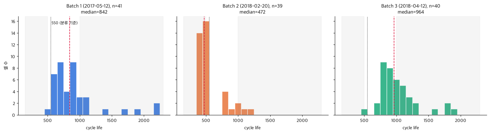
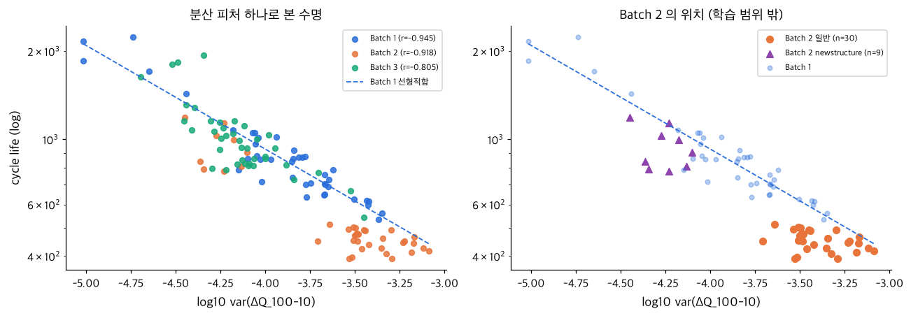
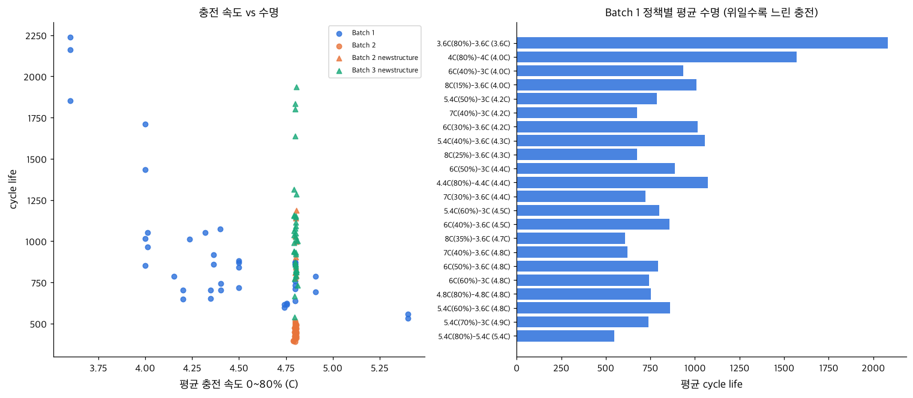
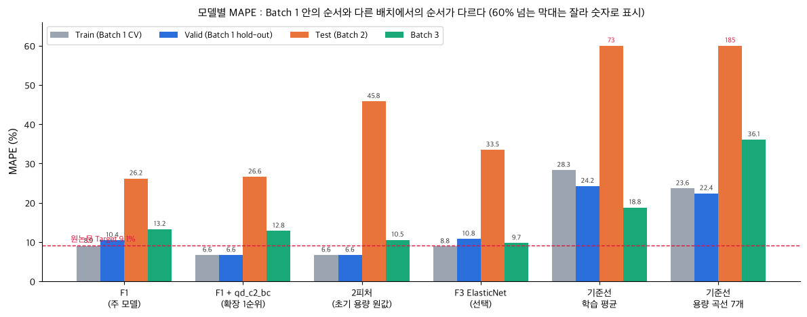
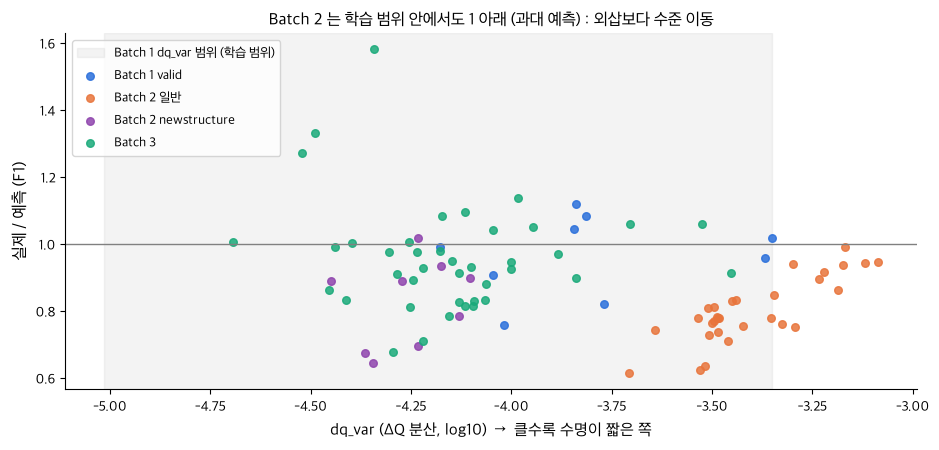

# ESS 배터리 수명 예측

초기 100 사이클 데이터로 셀의 수명(cycle life)을 예측해, ESS 배터리 교체를 수명 종료 전에 계획할 수 있는지 확인한다.

**결론 요약**
- 주 모델 : dq_var(cycle 100·10 방전 곡선 차이의 분산) 하나를 쓰는 선형회귀. Batch 1 CV 8.9%, Valid 10.4%
- Test : Batch 3 는 13.3% 로 같은 배치에서 낸 원논문 같은 구조 모델(11.4%)에 근접했고, Batch 2 는 26.2% 로 39셀 중 38셀을 길게 예측했다
- Batch 2 오차는 외삽(학습 범위 밖 값으로 예측)이 아니라 같은 dq_var 에서 수명 수준이 낮은 배치 차이로 보이며, Batch 1 만으로는 고칠 수 없다

## 프로젝트 개요
- 데이터셋 : MIT-Stanford Battery Dataset (Severson et al., Nature Energy 2019)
- 학습 데이터 : Batch 1 (2017-05-12), 41셀
- 평가 데이터 : Batch 2 (2018-02-20), 39셀 / 추가 검증 Batch 3 (2018-04-12), 40셀
- 태스크 : **Regression** (Cycle Life 예측). 타깃 log10(cycle life), 지표 MAPE
- DAY 1 설계서 : [`docs/DS-MINI-Design-울산_4반-이채목+이진우.pdf`](docs/DS-MINI-Design-울산_4반-이채목+이진우.pdf). DAY 2 는 이 설계서에 고정한 피처·모델·검증 방식을 그대로 구현했다.

## 파일 구조
```
├── data/README.md            # 원본 .mat 받는 곳과 배치 방법 (원본은 저장소에 없음)
├── docs/                     # DAY 1 설계서
├── notebooks/
│   ├── 01_EDA.ipynb          # 5개 질문 EDA (원본 필요)
│   ├── 02_feature_engineering.ipynb  # 피처 세트, 선택 규칙, Batch 1 사전 CV
│   └── 03_modeling.ipynb     # 학습·평가, 오류 분석, 상세 Gap 해석
├── src/
│   ├── preprocess.py         # .mat → 셀 단위 pickle
│   ├── features.py           # 셀 정리(제외·수명 보정), 초기 100 사이클 피처
│   ├── split.py · train.py   # Batch 1 정책 단위 분할 · 학습·평가
│   ├── procedure.py          # 시험 절차(휴지 시간) 측정
│   └── plot_style.py         # 그림 한글 폰트 (macOS·Windows·Linux)
└── results/
    ├── model_performance.csv · model_comparison.csv   # 주 모델 성능표 · 13개 모델 비교
    ├── predictions.csv · cv_folds.csv                 # 셀별 예측 · 폴드별 MAPE
    ├── cell_features.csv     # 사용 셀 120개의 피처·수명. 원본 없이 재현할 때의 입력
    └── figures/
```

## 환경 설정
```bash
git clone https://github.com/97-99-02/ess-battery-project
cd ess-battery-project
pip install -r requirements.txt      # Python 3.11
python src/train.py                  # results/*.csv
```
- **원본 없이 재현** : 위 네 줄이면 된다. `data/processed/` 가 없으면 `train.py` 가 `results/cell_features.csv` 로 학습·평가하고, 커밋된 결과 CSV 와 같은 파일이 나온다 (약 1분). 노트북 02·03 도 원본 없이 실행된다.
- **원본부터 실행** : `data/README.md` 대로 .mat 3개(약 7.8GB)를 `data/raw/` 에 두고 `python src/preprocess.py` 를 먼저 실행한다. 01_EDA 와 `src/procedure.py` 만 원본이 필요하다.

## 데이터 정리
논문 공식 코드(Load Data.ipynb)의 기준을 따른다 (설계서 부록 A2).

| 배치 | 원본 | 제외 | 사용 | 비고 |
|---|---|---|---|---|
| Batch 1 | 46 | 80% 미도달 5셀 | 41 | 다음 배치에서 측정이 이어진 c0\~c4 수명 보정 (+208\~+1060) |
| Batch 2 | 47 | 수명값 없음 8셀 | 39 | 일반 30셀 + newstructure 9셀 |
| Batch 3 | 46 | noisy 6셀 | 40 | 전부 newstructure. 원논문 secondary test 와 같은 배치 |

newstructure : 충전 정책 이름에 `newstructure` 가 붙은 셀. 사이클 사이 휴지 시간을 거의 없앤 시험 절차로 측정됐다.

## EDA
- **Cycle Life 분포** : 중앙값 842 / 472 / 964.5 (Batch 1 / 2 / 3). 학습 배치에 550 미만 셀이 41개 중 1개뿐이라 분류 대신 회귀로 정했다. 과제 설명과 달리 Batch 2 일반 셀 30개는 전부 Batch 1 최솟값(534)보다 짧다.

  

- **열화 곡선** : 처음 100 사이클은 거의 평탄하고 (cycle 100 / cycle 2 용량 중앙값 +0.22%), knee 는 수명의 55\~82% 지점이다. 예측 시점(cycle 100)에는 용량 값의 차이도 knee 도 없어, 신호는 곡선 모양에서 찾아야 한다.
- **ΔQ(V) 곡선** : ΔQ<sub>100-10</sub>(V) = Q<sub>100</sub>(V) − Q<sub>10</sub>(V) 의 분산(dq_var)과 log 수명의 상관이 −0.945 / −0.918 / −0.805 다. 같은 셀 두 사이클의 차이라 과제가 지적한 배치별 Qdlin 시작점 차이가 상쇄된다.

  

  왼쪽 : 세 배치 모두 dq_var 가 클수록 수명이 짧다 (점선 = Batch 1 선형 적합). 오른쪽 : Batch 2 일반 셀은 Batch 1 선보다 아래에 몰려 있다 (DAY 1 에 적은 가장 큰 위험).

- **충전 속도(C-rate)와 수명** : Batch 1 은 정책별 평균 수명이 546 \~ 2083 으로 3.8배 차이 나고 평균 충전 속도가 빠를수록 짧다 (r = −0.78). Batch 2·3 은 모든 정책의 평균 충전 속도가 4.8C 로 같아 이 관계를 옮길 수 없으므로, 충전 조건의 영향은 ΔQ 로 받는다.

  

- **추가 확인** : dq_var·dq_min·dq_mean 과 충전 시간·평균 충전 속도가 각각 r 0.99 로 묶여 Batch 1 VIF 가 최대 384 다. 주 모델에는 하나만 두고 여러 피처 세트는 규제 모델로만 다룬다. Batch 2 일반 셀은 시험 절차도 달라 cycle 10 휴지 합계가 9.9분이다 (Batch 1 1.0분, newstructure 0.3분).

## Modeling
### 피처 엔지니어링 전략
선택 규칙은 DAY 1 에 고정했고 (설계서 S2·S3), 결정에는 Batch 1 과 라벨 없는 입력 분포만 썼다.
1. **입력 규칙 ①** : Batch 2 입력이 Batch 1 평균 ± 2σ 밖인 셀이 39개 중 4개 이하인 피처만 주 모델에 쓴다. dq_var 는 1셀, 용량 계열은 18\~24셀이 벗어난다.
2. **1-SE 규칙 ②** : ① 통과 세트 중 CV 최저 모델과 1 표준오차 안이면 가장 단순한 모델을 고른다.
3. **예외** : 배치 단위로 변환한 피처(배치 평균을 뺀 값 등)는 ① 의 판정 대상이 아니며 확장 후보로만 둔다.

| 세트 | 피처 | 역할 |
|---|---|---|
| **F1** | dq_var | **주 모델** |
| 확장 1순위 | dq_var, qd_c2_bc (같은 배치 평균을 뺀 cycle 2 용량) | 함께 보고 |
| 2피처 | dq_var, qd_c2 (원값) | 비교 (규칙 ① 탈락) |
| F2 / F3 / F4 | ΔQ 통계량 5개 / + 2V·방전 용량 곡선 7개 / + 충전 시간·온도·내부저항 (논문 Supplementary Table 1 구성) | 선택 |

### 모델 선택 및 근거
- 최종 모델 : **F1 선형회귀** `log10(life) = 1.5524 − 0.3537 · dq_var` (Batch 1 41셀). 후보 13개는 아래 모델 비교 표
- 선택 이유 : 규칙 ① 을 통과한 세트에서 Batch 1 CV 가 가장 낮고(8.93%) 가장 단순하다. 원논문 variance 모델과 같은 구조라 직접 비교할 수 있다.
- 검증 : Batch 1 을 충전 정책 단위로 train 32셀·17정책 / valid 9셀·5정책으로 나눴다. Train 은 train 32셀 정책 단위 GroupKFold(5), Valid 는 train 32셀 모델로 평가했다. Test 는 Batch 1 41셀 전체로 다시 학습한 최종 모델로 Batch 2·3 를 한 번 평가했다 (32셀 모델 대비 Batch 2 예측 비 0.99배를 테스트 전에 라벨 없이 확인).

## 성능 결과
주 모델 F1 (`results/model_performance.csv`). Gap 은 '뒤 − 앞' 으로 계산해 (+) 가 나빠짐이고, Gap(Batch2-Batch3) 는 이름대로 Batch 2 − Batch 3 다.

| 구분 | | MAPE (%) | 비고 |
|---|---|---|---|
| Train (Batch 1 CV) | | 8.93 | 폴드 표준편차 3.1 |
| Valid (Batch 1 Hold-out) | | 10.41 | 9셀, 부트스트랩 95% 구간 4.7\~17.5 |
| Test (Batch 2) | | 26.17 | 최종 모델, 한 번 평가 |
| | Gap (Train-Valid) | +1.48 | (+) : 과적합 의심 |
| | Gap (Valid-Test) | +15.76 | (+) : 배치간 일반화 저하 의심 |
| | Gap (Target-Test) | +17.07 | Target : 원논문 9.1%. 같은 구조인 variance 모델을 같은 방식으로 재구성한 12.3% 대비 +13.87 |
| Test (Batch 3) | | 13.25 | 추가 검증 |
| | Gap (Batch2-Batch3) | +12.92 | Test 성능 간 비교. Batch 2 가 12.92%p 나쁨 |
| | Gap (Target-Test) | +4.15 | Batch 3 기준. 같은 배치인 원논문 variance 모델 secondary test 11.4% 대비 +1.85 |

Target 9.1% 는 원논문 full 모델의 primary 7.5%(이례 셀 1개 제외)와 secondary 10.7% 를 셀 수로 가중한 값이고, 같은 방식으로 variance 모델은 12.3% 다. 원논문 secondary test 는 우리 Batch 3 와 같은 배치지만, Batch 2(2018-02-20)는 원 출처([data.matr.io](https://data.matr.io/1/projects/5c48dd2bc625d700019f3204))에서 논문 배치가 아니라 'Low rate data used to generate figure 4' 로 분류된 파일이다. 그래서 원논문과 같은 시험지로 비교할 수 있는 것은 Batch 3 뿐이다.

### 모델 비교 (`results/model_comparison.csv`, 13개 전체)

| 모델 | 역할 | Train CV | Valid | Batch 2 | Batch 3 |
|---|---|---|---|---|---|
| **F1** | **주 모델** | 8.93 | 10.41 | 26.17 | 13.25 |
| F1 + qd_c2_bc | 확장 1순위 | 6.63 | 6.63 | 26.56 | 12.79 |
| 2피처 (F1 + qd_c2) | 비교 (규칙 ① 탈락) | 6.63 | 6.63 | 45.80 | 10.53 |
| 기준선 : 학습 평균 | 기준선 | 28.29 | 24.22 | 73.24 | 18.79 |
| 기준선 : 용량 곡선 7개 ElasticNet | 기준선 | 23.61 | 22.37 | 185.40 | 36.06 |
| F1 + qd_c2_bz | 선택 : 표준화 민감도 | 6.63 | 6.63 | 25.93 | 12.88 |
| F2 ElasticNet | 선택 : 확장 후보 | 10.75 | 10.58 | 30.38 | 12.71 |
| F2 Ridge | 선택 : 규제 비교 | 11.72 | 10.53 | 29.90 | 15.89 |
| F3 ElasticNet | 선택 : 확장 후보 | 8.84 | 10.75 | 33.45 | 9.72 |
| F3 Ridge | 선택 : 규제 비교 | 9.35 | 13.94 | 28.81 | 14.93 |
| F4 ElasticNet | 선택 : Batch 1 비교만 | 9.36 | 9.70 | − | − |
| F1 RandomForest | 선택 : 비선형 비교 | 15.34 | 14.49 | 32.10 | 12.92 |
| F1 XGBoost | 선택 : 비선형 비교 | 16.42 | 15.45 | 39.55 | 20.75 |

F4 는 Batch 2 의 6셀에 내부저항이 없어 Batch 1 비교에만 쓴다. qd_c2 를 쓴 세 모델은 Batch 1 안에서 예측이 같아 Train·Valid 가 같다 (qd_c2_bc·bz 는 qd_c2 를 같은 값으로 빼고 나눈 것).

- **Batch 2** 최저는 표준화 민감도 25.93% 로, F1(26.17%)·확장 1순위(26.56%)와 1%p 안이다. **Batch 3** 에서는 F3 ElasticNet 9.72, 2피처 10.53, F2 ElasticNet 12.71, 확장 1순위 12.79, 표준화 민감도 12.88, RandomForest 12.92% 가 F1(13.25%)보다 낮다.
- 2피처·F3 는 Batch 3 에서 낮지만 Batch 2 에서 45.80·33.45% 로 나쁘다. 초기 용량의 배치 오프셋이 배치마다 반대 방향으로 작용한 것으로 본다. 두 Test 배치 모두에서 F1 과 0.4%p 안이거나 더 낮은 모델은 배치 보정 피처를 쓴 확장 1순위·표준화 민감도뿐이다.
- 주 모델은 DAY 1 규칙(Batch 1 CV·라벨 없는 입력 분포)으로 고정했고 테스트 결과로 바꾸지 않았다. 상세 해석은 노트북 03 2절.



그림은 필수 보고 모델 5개(F1·확장 1순위·2피처·기준선 2개)와 F3 ElasticNet 만 그렸다.

### 집단별 결과 (주 모델 F1)

| 집단 | 셀 수 | MAPE (%) | 과대 예측 비율 | 실제 / 예측 (중앙값) | 80% 예측구간 하한보다 일찍 끝난 비율 |
|---|---|---|---|---|---|
| Batch 1 valid | 9 | 10.41 | 56% | 0.99 | 22% |
| Batch 2 일반 | 30 | 26.67 | 100% | 0.78 | 77% |
| Batch 2 newstructure | 9 | 24.52 | 89% | 0.89 | 44% |
| Batch 3 | 40 | 13.25 | 68% | 0.94 | 30% |




위 : 대각선 위 = 과대 예측. 아래 : 회색 띠 = Batch 1 의 dq_var 범위. Batch 2 일반 셀(주황)은 학습 범위 안에서도 1 아래(과대 예측)이고, 범위 밖 셀은 오히려 1 에 가깝다.

### Gap 해석
- **Train-Valid (+1.48)** : Valid 9셀의 부트스트랩 구간(4.7\~17.5) 안이라 과적합 신호는 약하다.
- **Valid-Test (+15.76), Target-Test (+17.07)** : Batch 2 를 체계적으로 길게 예측했다 (일반 30셀 전부, newstructure 9셀 중 8셀). 외삽이 주원인은 아니다. dq_var 가 Batch 1 범위 밖인 일반 셀 11개의 오차(13.3%)가 범위 안 19개(34.4%)보다 작다. 같은 dq_var 에서 수명 수준이 낮게 평행 이동한 것이고, Batch 1 에 없는 요인이라 Batch 1 만으로는 고칠 수 없다.
- **Batch2-Batch3 (+12.92), Batch 3 Target-Test (+4.15)** : 같은 F1 이 Batch 3 에서는 같은 배치의 원논문 variance 모델(11.4%)과 1.85%p 차이다. 그래서 큰 Gap 은 피처가 Batch 1 에 과적합된 결과가 아니라 Batch 2 의 수준 이동으로 본다. 시험 절차가 Batch 3 와 같은 Batch 2 newstructure 도 과대 예측(0.89)이라 절차 차이만으로는 설명되지 않고, 셀 로트 차이일 가능성도 남는다.

나머지 근거(2피처의 배치 오프셋, 논문 정의 F3 의 CV, 시험 절차 비교)는 노트북 03 의 2·6·11·12절 해석 칸에 있다.

## 오류 분석
- **가장 크게 틀린 셀의 공통점** : F1 의 Batch 2·3 오차 상위 10셀은 모두 과대 예측이고 (Batch 2 일반 5, newstructure 3, Batch 3 2), 실제 수명 393\~841 셀을 597\~1248 로 예측했다. 10셀 모두 dq_var 가 Batch 1 범위 안이다 (노트북 03 10절).
- **원인 가설**
  - Batch 2 : 같은 dq_var 에서 수명이 낮은 수준 이동. 시험 절차 차이와 셀 로트 차이를 이 데이터로는 분리할 수 없다.
  - 정책 내 차이 : Batch 1 CV 잔차의 정책 내 표준편차가 log10 0.046(약 8.5%)으로, 정책만 알 때의 하한 0.035(약 6.4%)보다 크다. dq_var 는 같은 정책 안의 셀 차이를 못 잡는다.
- **개선 방향**
  - 재보정 : Batch 2 에서 가장 먼저 끝난 5셀로 절편만 맞추면 나머지 34셀이 24.2 → 13.0% 가 된다 (무작위 5셀이면 26.7 → 11.5%). 그 시점(cycle 412)에 나머지 일반 셀은 이미 수명의 80% 를 지나 있어, 수명 종료보다 이른 신호로 보정해야 한다 (노트북 03 9절).
  - 배치 안 순위 : 확장 1순위는 순위 상관을 Batch 2 일반 0.38 → 0.75, Batch 3 0.76 → 0.84 로 올렸지만 newstructure 9셀에서는 0.17 → −0.33 으로 나빠졌다 (노트북 03 8절).
  - 시험 절차가 다른 배치를 학습에 넣으면 절차 차이를 피처로 다룰 수 있다.

## ESS 도메인 해석
- **활용할 수 있는 의사결정**
  - 교체 계획 : 점 예측 대신 80% 예측구간 하한을 쓰고, 용량 손실이 knee 이후에 몰리므로 **하한 × 0.65** 시점부터 교체를 준비한다 (0.65 = Batch 1 의 knee 사이클 / 수명 최솟값). 준비 전에 수명이 끝난 셀은 없었다. Batch 1 valid·Batch 3 는 일찍 준비하는 비용이 있고, Batch 2 는 과대 예측 때문에 준비가 늦어져 가장 촉박한 셀은 수명 종료 26 사이클 전에 준비를 시작했다.

    | 구분 | 준비 전에 수명이 끝난 셀 | 준비 시작 시점 (실제 수명 대비, 중앙값) | knee 이후에 준비가 시작된 셀 | 준비 후 남은 사이클 (최소) |
    |---|---|---|---|---|
    | Batch 1 valid | 0 / 9 | 58% | 11% | 169 |
    | Batch 2 | 0 / 39 | 74% | 72% | 26 |
    | Batch 3 | 0 / 40 | 62% | 8% | 113 |
  - 새 로트 수용 점검 : 입고 로트의 cycle 100 입력을 학습 분포와 비교해(입력 규칙 ①) 벗어나면 예측을 보류하거나 재보정한다.
  - 팩 구성·재보정 : 같은 로트 안 순위는 확장 1순위가 더 잘 맞혔고, 새 로트에서 일찍 끝난 셀 몇 개로 절편을 맞추는 절차를 운영에 넣는다.
- **한계와 실 배포에 필요한 것**
  - 새 배치에서 예측구간이 맞지 않는다 (구간 하한보다 일찍 끝난 셀 Batch 2 일반 77%, Batch 3 30%). 배치가 바뀌면 구간을 다시 맞춰야 한다.
  - 오차 26% 는 Batch 2 수명 중앙값 472 기준 약 124 사이클(하루 1회면 약 4개월)이다. 1MWh 당 $30,000\~80,000 인 셀 교체 비용(과제 도메인 설명)의 집행 시점이 그만큼 어긋날 수 있고, 과대 예측 쪽이면 교체 전에 수명이 끝나 설비 중단으로 이어질 수 있다.
  - 학습 41셀·Valid 9셀로 표본이 작고, 시험 조건(30℃ 챔버, 고속 충전, 4C 방전)이 실제 ESS 운전과 같은지 확인이 필요하다. ΔQ 계산에는 완전 방전 곡선과 셀 단위 계측이 필요하다.

## 고민의 과정과 회고
### 고민했던 지점
- **연습 점수가 더 좋았던 2피처를 왜 고르지 않았나** : Batch 1 CV 만 보면 2피처(6.6%)가 F1(8.9%)보다 좋았다. 하지만 정답 없이 입력만 봐도 Batch 2 의 초기 용량이 학습 배치보다 높아 예측을 부풀릴 것이 보였다. 연습 점수보다 다른 배치로 옮겨 갈 수 있는지를 우선해 F1 을 골랐다 (2피처는 Batch 2 에서 45.8%).
- **최종 모델을 32셀로 학습할지 41셀로 학습할지** : 32셀 모델 하나로 Valid 와 Test 를 보면 Gap 비교가 깔끔하고, 41셀로 다시 학습하면 데이터를 다 쓴다. 설계서가 학습 데이터를 41셀로 두고 있어 41셀을 택했다.
- **Batch 2 결과(26%)를 보고도 주 모델을 바꾸지 않은 이유** : 테스트 결과를 보고 피처나 모델을 고치면 그 점수는 답을 보고 맞춘 점수가 된다. Batch 2 과대 예측은 DAY 1 설계서에 이미 가장 큰 위험으로 적어 둔 것이라, 모델을 바꾸는 대신 왜 틀렸는지를 분석했다. Batch 2 에서 F1 보다 0.24%p 낮았던 표준화 민감도도 같은 이유로 주 모델로 올리지 않았다.
- **ESS 교체 규칙 0.55 → 0.65** : 처음 쓴 준비 비율 0.55 가 Batch 2 의 knee 비율, 즉 테스트 배치의 정답에서 나온 값이라는 피드백을 받았다. 같은 배치로 규칙을 확인하면 순환이 되므로 Batch 1 값 0.65 로 바꿨고, 결론(준비 전에 수명이 끝난 셀 0개)이 같다는 것을 확인했다.
- **과제 설명과 원 출처가 다른 점** : 과제·캐글 설명만 보면 Batch 2 가 원논문 1차 테스트셋으로 보였는데, 원 출처의 배치 목록을 직접 확인해 다르다는 것을 알았다. 그래서 원논문과의 비교는 같은 배치인 Batch 3 를 중심으로 해석했다.

### 팀 회고
가장 크게 배운 건 연습 점수가 실전 성능을 보장하지 않는다는 점이었습니다. Batch 1 교차검증에서 가장 좋았던 2피처 모델이 Batch 2 에서는 가장 크게 무너지는 걸 보면서, 점수보다 다른 배치에서도 통하는 피처인지를 먼저 따져야 한다는 걸 체감했습니다. 데이터가 41셀뿐이다 보니 피처를 많이 넣거나 트리 모델을 쓰는 것보다 dq_var 하나로 그은 직선이 더 안정적이었던 것도 인상 깊었습니다. 아쉬운 점은 표본이 작아 Valid 점수가 4.7\~17.5% 사이에서 크게 흔들릴 수 있다는 것, 그리고 같은 충전 정책 안에서 어느 셀이 먼저 수명이 끝날지는 끝내 잡지 못했다는 것입니다. 다시 한다면 새 배치에서 일찍 수명이 끝난 셀 몇 개로 모델을 보정하는 단계를 처음부터 설계에 넣고, 수명 종료보다 이른 신호로 보정하는 방법까지 함께 고민하고 싶습니다.

## 참고문헌
- Severson et al. (2019). Data-driven prediction of battery cycle life before capacity degradation. Nature Energy, 4, 383–391.

## 팀 구성
- 이채목 : EDA, 피처 엔지니어링, 모델 개발, 성능 평가(Batch 2·3), README
- 이진우 : EDA, 결과 검증, Gap 해석, ESS 도메인 해석, README
